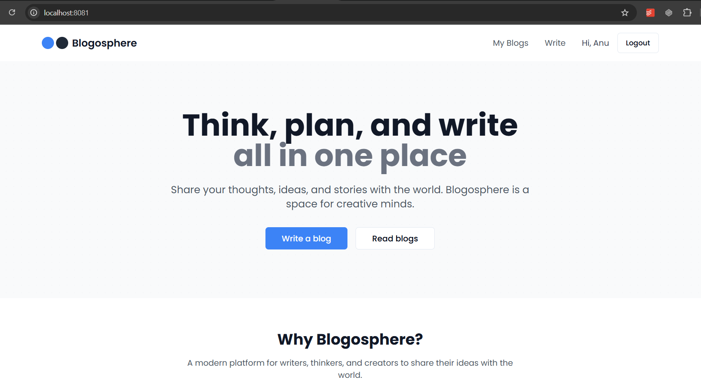

# Blog Application
A full-stack blog application allowing users to create, view, and manage blog posts with authentication.

## 🎥 Demo Video (click to play)

[](https://www.loom.com/share/eddb7c28011240b1b34665e1af8f70af)

## Features
- User authentication using email and password
- Create, read, update, and delete blog posts
- Public blog listing with pagination
- Responsive design for desktop and mobile devices
- Role-based access control (only authors can edit/delete their own blogs)

## Project Structure
This project consists of two main folders:
- `client/`: Frontend React application
- `server/`: Backend Express.js API with TypeScript and MongoDB


## Prerequisites
Before you begin, ensure you have the following installed:
- [Node.js](https://nodejs.org/) (v14 or later)
- [MongoDB](https://www.mongodb.com/try/download/community) (local or MongoDB Atlas)
- [Git](https://git-scm.com/)

## Setup Instructions
### 1. Clone the repository
```bash
git clone <repository-url>
cd blog-application
```

### 2. Set up environment variables
#### For the server:
Create a `.env` file in the `server/` directory with the following variables:

```
NODE_ENV=development
PORT=5001
MONGO_URI=your_mongo_db_url
JWT_SECRET=your_jwt_secret_key_here
```

*Note: Replace `your_jwt_secret_key_here` with a strong secret key and update the `MONGO_URI` if you're using MongoDB Atlas.*

### 3. Install dependencies
You need to install dependencies for both the client and server:
```bash
# Install server dependencies
cd server
npm install

# Install client dependencies
cd ../client
npm install
```

### 4. Start the application
You need to run both the server and client in separate terminal windows:

#### Terminal 1 - Start the server:
```bash
cd server
npm run dev
```
The server will start on port `5000` (or the port specified in your `.env` file).

#### Terminal 2 - Start the client:
```bash
cd client
npm run dev
```
The client development server will start and display a URL (typically `http://localhost:3000` or `http://localhost:5173`) which you can click to open in your browser.

## API Documentation
### Authentication Endpoints
- **Register:** `POST /api/v1/auth/register`
- **Login:** `POST /api/v1/auth/login`
- **Profile:** `GET /api/v1/auth/profile`

### Blog Endpoints
- **Get all blogs:** `GET /api/v1/blogs?page=1&limit=10`
- **Get blog by ID:** `GET /api/v1/blogs/:id`
- **Create blog:** `POST /api/v1/blogs`
- **Update blog:** `PUT /api/v1/blogs/:id`
- **Delete blog:** `DELETE /api/v1/blogs/:id`

## Usage
1. Register a new account or log in with existing credentials.
2. Create new blog posts from your dashboard.
3. View all blogs on the home page.
4. View, edit, or delete your own blogs from the blog detail page.

## Technologies Used
### Frontend
- React.js
- React Router
- Context API for state management
- CSS/SCSS for styling

### Backend
- Node.js
- Express.js
- TypeScript
- MongoDB with Mongoose
- JWT for authentication

## License
[MIT](LICENSE)
